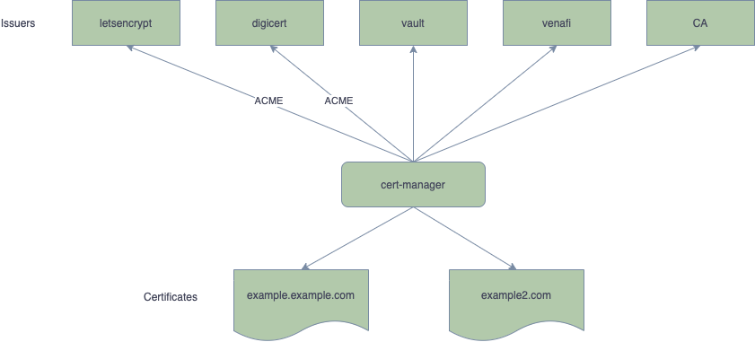
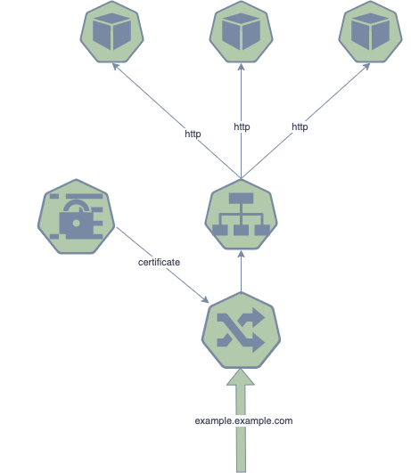
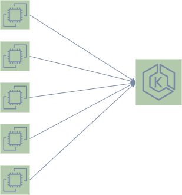

# cert-manager demo



**Notes:**
- DigiCert [article](https://knowledge.digicert.com/solution/Configure-cert-manager-and-DigiCert-ACME-service-with-Kubernetes.html) to configure cert-manager.
## Create kind cluster

Check this [article](https://dustinspecker.com/posts/test-ingress-in-kind/)

```bash
kind create cluster --config kind/kind.yaml --name cert-manager-demo
```

## Install nginx ingress controller

```bash
kubectl apply --filename https://raw.githubusercontent.com/kubernetes/ingress-nginx/master/deploy/static/provider/kind/deploy.yaml
```
## Install cert-manager

```bash
helm repo add jetstack https://charts.jetstack.io

helm install cert-manager jetstack/cert-manager --namespace cert-manager --create-namespace --version v1.4.0 --set installCRDs=true
```

## kuard application

```bash
kubectl apply --filename https://netlify.cert-manager.io/docs/tutorials/acme/example/deployment.yaml

kubectl apply --filename https://netlify.cert-manager.io/docs/tutorials/acme/example/service.yaml
```
## Install self-signed issuer

```bash
kubectl apply --filename cert-manager/selfsigned-issuer.yaml
```


## kuard ingress

```bash
kubectl apply --filename kuard-ingress.yaml
```

## IP for host

```bash
docker container inspect cert-manager-demo-control-plane --format '{{ .NetworkSettings.Networks.kind.IPAddress }}'
```

## Test TLS

The certificate is self signed so use `--insecure` for `curl`

```bash
docker run --add-host example.example.com:172.18.0.2 --net kind --rm curlimages/curl:7.71.0 --insecure -vvv https://example.example.com
```

## Create a certificate

```bash
kubectl apply --filename certificate.yaml

kubectl describe certificate example2-com
```

## As A Service




